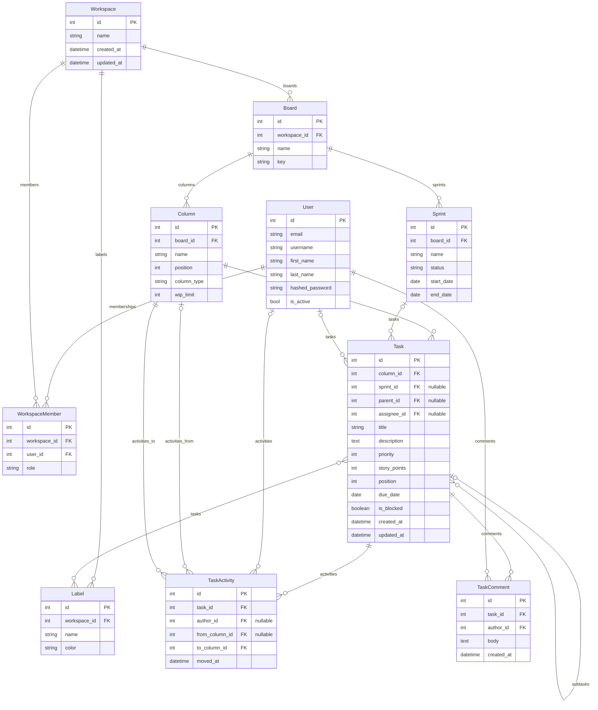

# Domain Entity Relationship Diagram

```mermaid
erDiagram
    User {
        int id PK
        string email
        string username
        string first_name
        string last_name
        string hashed_password
        bool is_active
    }

    Workspace {
        int id PK
        string name
        datetime created_at
        datetime updated_at
    }

    WorkspaceMember {
        int id PK
        int workspace_id FK
        int user_id FK
        string role
    }

    Board {
        int id PK
        int workspace_id FK
        string name
        string key
    }

    Sprint {
        int id PK
        int board_id FK
        string name
        string status
        date start_date
        date end_date
    }

    Column {
        int id PK
        int board_id FK
        string name
        int position
        string column_type
        int wip_limit
    }

    Label {
        int id PK
        int workspace_id FK
        string name
        string color
    }

    Task {
        int id PK
        int column_id FK
        int sprint_id FK "nullable"
        int parent_id FK "nullable"
        int assignee_id FK "nullable"
        string title
        text description
        int priority
        int story_points
        int position
        date due_date
        boolean is_blocked
        datetime created_at
        datetime updated_at
    }

    TaskActivity {
        int id PK
        int task_id FK
        int author_id FK "nullable"
        int from_column_id FK "nullable"
        int to_column_id FK
        datetime moved_at
    }

    TaskComment {
        int id PK
        int task_id FK
        int author_id FK
        text body
        datetime created_at
    }

    User ||--o{ WorkspaceMember : "memberships"
    Workspace ||--o{ WorkspaceMember : "members"
    Workspace ||--o{ Board : "boards"
    Board ||--o{ Sprint : "sprints"
    Board ||--o{ Column : "columns"
    Workspace ||--o{ Label : "labels"
    Column ||--o{ Task : "tasks"
    Sprint |o--o{ Task : "tasks"
    Task |o--o{ Task : "subtasks"
    User |o--o{ Task : "tasks"
    Task }o--o{ Label : "tasks"
    Task ||--o{ TaskActivity : "activities"
    User |o--o{ TaskActivity : "activities"
    Column |o--o{ TaskActivity : "activities_from"
    Column ||--o{ TaskActivity : "activities_to"
    Task ||--o{ TaskComment : "comments"
    User ||--o{ TaskComment : "comments"
```
