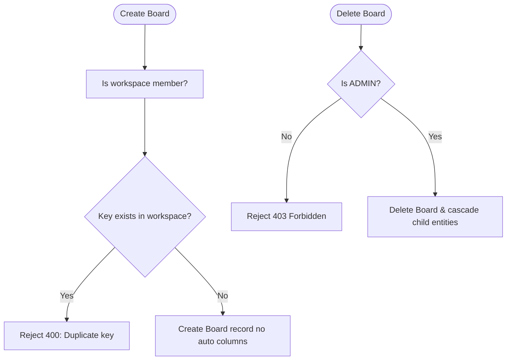

# Epic: Board Management (`BO`)

**Entities:** `Board`, `Workspace` | **See:** [permissions.md](../permissions.md), [conventions.md](../conventions.md)

## Overview

**User Story:** As a workspace member, I want to create and manage boards within my workspace to organize work by project or team.

## Domain Rules

- **Board access is workspace access:** Any workspace member can view all boards in their workspace.
- **Unique Keys:** `Board.key` must be unique per workspace, display-only, and immutable after creation.

## Capability Matrix

| Operation | Role Required | Behavior / Invariants | Scenarios |
| --- | --- | --- | --- |
| Create Board | Member or Admin | Unique `key` per workspace; no auto-generated columns | `BO-01`, `BO-02`, `BO-03` |
| List / Retrieve Board | Any member (incl. Guest) | Scoped to workspace | Standard Read |
| Update Board Name | Member or Admin | `key` is immutable (silently ignored if resubmitted) | `BO-05` |
| Delete Board | Admin only | Destructive cascade to columns, sprints, and tasks | `BO-04` |

## Business Logic Flowchart



## Scenarios

### BO-01: Create a board with a unique key

```gherkin
Given workspace "Acme Corp" has no board with key "ENG"
When a member creates a board with key "ENG"
Then the board is created without auto-generating columns
```

### BO-02: Reject duplicate board key in same workspace

```gherkin
Given workspace "Acme Corp" already has a board with key "ENG"
When a member attempts to create another board with key "ENG"
Then the request is rejected with 400 (validation error)
```

### BO-03: Same key allowed in different workspace

```gherkin
Given workspace "Acme Corp" has a board with key "ENG"
And workspace "Beta Inc" has no board with key "ENG"
When a member of "Beta Inc" creates a board with key "ENG"
Then the board is created successfully
```

### BO-04: Delete board cascades to child entities

```gherkin
Given board "ENG" has columns, sprints, and tasks
When an ADMIN deletes board "ENG"
Then the board and all its child entities are deleted
```

### BO-05: Board key is immutable

```gherkin
Given board "ENG" exists
When a member attempts to PATCH the key to "ENG2"
Then the request succeeds, but the key remains "ENG" (silently ignored)
```
