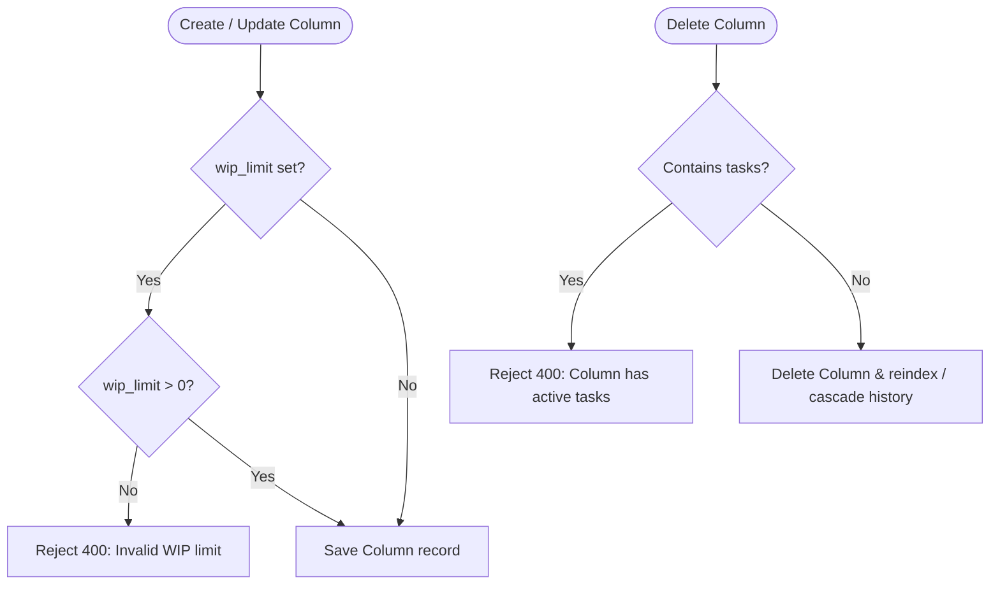

# Epic: Column Configuration (`CC`)

**Entities:** `Column`, `Board` | **See:** [permissions.md](../permissions.md), [conventions.md](../conventions.md)

## Overview

**User Story:** As a board manager, I want to configure columns with custom titles, workflow stages, order positions, and WIP limits to control process flow.

## Domain Rules

- **Name vs. Type:** `Column.name` is a free-text label unique per board. `Column.column_type` is an enum (`backlog`, `active`, `done`) that governs workflow tracking (e.g., `done` signals task completion for sprints).
- **WIP Limits:** Apply uniformly to any column; must be a positive integer or null (unlimited).
- **Multiple Done Columns:** Allowed by default (convention, not system-enforced).

## Capability Matrix

| Operation | Role Required | Behavior / Invariants | Scenarios |
| --- | --- | --- | --- |
| Create Column | Member or Admin | Appends column with next sequential position | `CC-01` |
| List Columns | Any member (incl. Guest) | Ordered by `position` ascending | Standard Read |
| Update Column | Member or Admin | Updates `name`, `column_type`, or `wip_limit` | `CC-02` |
| Reorder Columns | Member or Admin | Updates contiguous `position` indexes atomically | `CC-01` |
| Delete Column | Admin only | Rejected if column contains tasks | `CC-03`, `CC-04` |

## Business Logic Flowchart



## Scenarios

### CC-01: Reordering columns shifts sibling positions atomically

```gherkin
Given board "ENG" has columns (Backlog, In Progress, Done)
When the user moves "Done" to position 1
Then positions update atomically and remain contiguous (0, 1, 2)
```

### CC-02: WIP limit validation

```gherkin
Given column "In Progress"
When the user sets wip_limit to -1
Then the request is rejected with 400 Bad Request
When set to null, the request succeeds with no WIP limit
```

### CC-03: Deleting a column with tasks is prevented

```gherkin
Given column "In Progress" contains tasks
When the user attempts to delete it
Then the request is rejected with 400 Bad Request
```

### CC-04: Deleting an empty column erases its activity history

```gherkin
Given column "Code Review" has 0 current tasks but 5 TaskActivity references
When an admin deletes the column
Then deletion succeeds, and referencing TaskActivity rows are also deleted (cascade)
```
