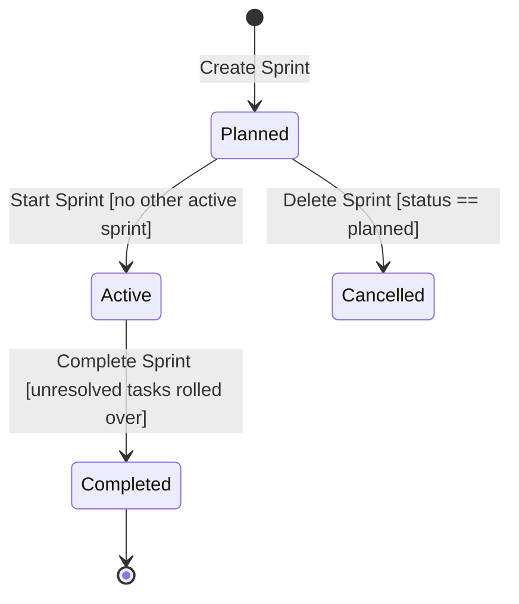
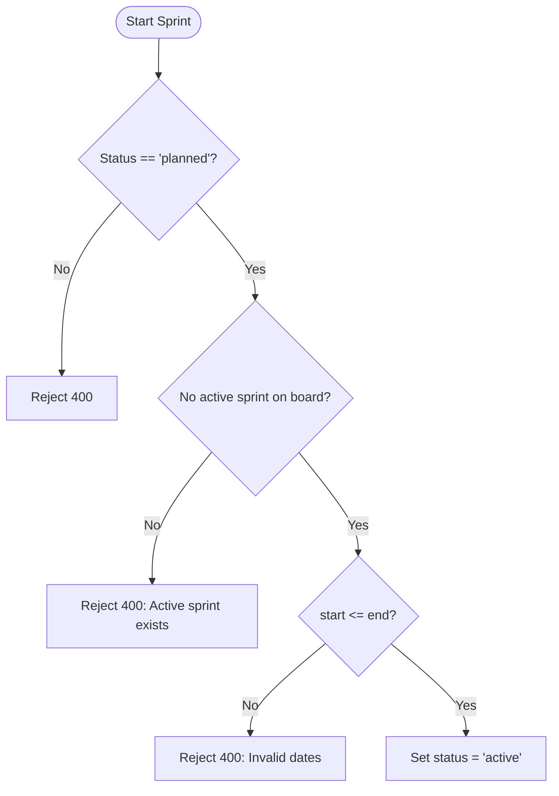

# Epic: Sprint Planning & Lifecycle (`SP`)

**Entities:** `Sprint`, `Board`, `Task` | **See:** [permissions.md](../permissions.md), [conventions.md](../conventions.md), [task_lifecycle.md](./task_lifecycle.md)

## Overview

**User Story:** As a Scrum master or project manager, I want to plan timeboxed iterations, start active sprints, commit tasks, and close sprints to measure team velocity.

## Domain Rules

- **Completion Criteria:** A task is complete if `task.column.column_type == "done"` at sprint completion.
- **Board Consistency:** A task's sprint and column must belong to the same board.
- **Deletion Rule:** Sprints can only be deleted while `status="planned"`.

## Capability Matrix

| Operation | Role Required | Behavior / Invariants | Scenarios |
| --- | --- | --- | --- |
| Create Sprint | Member or Admin | Default status `planned`; valid date ordering | `SP-02` |
| List Sprints | Any member (incl. Guest) | Filterable by board and status | Standard Read |
| Update Sprint | Member or Admin | Update name, goal, dates | Standard Write |
| Start Sprint | Member or Admin | Transition `planned` → `active` (one active per board) | `SP-01` |
| Complete Sprint | Member or Admin | Transition `active` → `completed`; rolls off incomplete tasks | `SP-03`, `SP-05` |
| Delete Sprint | Member or Admin | Only permitted while `status="planned"` | `SP-06` |
| Assign Task to Sprint | Member or Admin | Task's board must match sprint's board | `SP-04` |

## Lifecycle & Flowcharts





## Scenarios

### SP-01: Only one active sprint per board

```gherkin
Given board "ENG" has an active "Sprint 1" and planned "Sprint 2"
When a user attempts to start "Sprint 2"
Then the request is rejected with 400 Bad Request

```

### SP-02: Sprint date interval validation

```gherkin
Given board "ENG"
When a user creates a sprint where start_date is after end_date
Then the request is rejected with 400 Bad Request

```

### SP-03: Completing a sprint unassigns incomplete tasks

```gherkin
Given active "Sprint 1" has task "T-10" (column type: done) and task "T-20" (column type: active)
When the user completes "Sprint 1"
Then "Sprint 1" becomes completed
And task "T-10" remains assigned, while task "T-20" sprint is cleared to null

```

### SP-04: Tasks must belong to the sprint's board

```gherkin
Given sprint "Sprint 1" belongs to board "Backend" and task "T-99" to "Frontend"
When assigning "T-99" to "Sprint 1"
Then the request is rejected with 400 Bad Request

```

### SP-05: Completing a non-active sprint is rejected

```gherkin
Given sprint "Sprint 1" has status="planned"
When a user attempts to complete it
Then the request is rejected with 400 Bad Request

```

### SP-06: Sprints can only be deleted while planned

```gherkin
Given sprint "Sprint 1" has status="active"
When a user attempts to delete it -> Rejected with 400
Given sprint "Sprint 2" has status="planned"
When a user deletes it -> Succeeds with 204 No Content (tasks have sprint cleared to null)

```
