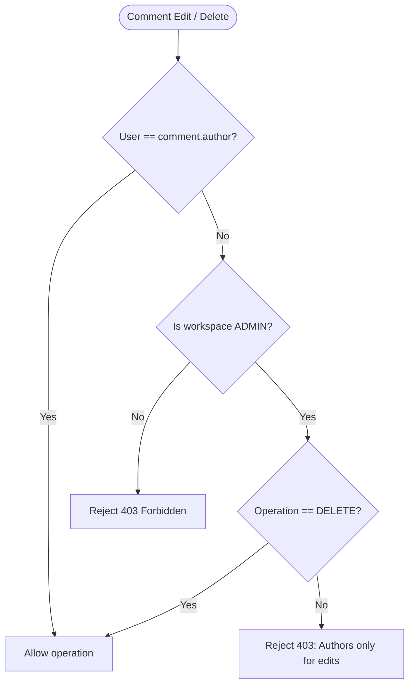

# Epic: Task Collaboration & Comments (`TC`)

**Entities:** `TaskComment`, `Task`, `User` | **See:** [permissions.md](../permissions.md), [conventions.md](../conventions.md)

## Overview

**User Story:** As a team member, I want to comment on tasks and discuss implementation details so that communication is centralized alongside the work item.

## Domain Rules

- **Comment Editing:** Author-only. Even a workspace `ADMIN` cannot edit someone else's comment.
- **Comment Deletion:** Allowed by the author OR a workspace `ADMIN`.
- **Security Boundary:** Non-members receive `404 Not Found` for any interaction attempts.

## Capability Matrix

| Operation | Role Required | Behavior / Invariants | Scenarios |
| --- | --- | --- | --- |
| Create Comment | Member or Admin | Sets current user as `author`; body cannot be blank | `TC-01` |
| List Comments | Any member (incl. Guest) | Ordered by `created_at` ascending | Standard Read |
| Update Comment | Author only | Modifies `body` (strictly author-only) | `TC-02` |
| Delete Comment | Author or Admin | Removes comment | `TC-03` |

## Business Logic Flowchart



## Scenarios

### TC-01: Adding a comment associates the authenticated author

```gherkin
Given workspace member "Alice" posts a comment on task "T-42"
Then the comment is created with author set to "Alice" and correct timestamp

```

### TC-02: Non-authors cannot edit another user's comment

```gherkin
Given user "Alice" wrote comment "C-1"
When workspace member "Bob" attempts to update it
Then the request is rejected with 403 Forbidden (applies even if Bob is an ADMIN)

```

### TC-03: Admins can delete but not edit others' comments

```gherkin
Given user "Bob" wrote comment "C-1" and user "Alice" is a workspace ADMIN
When "Alice" attempts to update "C-1" -> Rejected with 403 Forbidden
When "Alice" attempts to delete "C-1" -> Succeeds with 204 No Content

```

### TC-04: Workspace boundary prevents cross-workspace commenting

```gherkin
Given user "Eve" is not a member of the workspace
When "Eve" attempts to post a comment
Then the request is rejected with 404 Not Found

```
