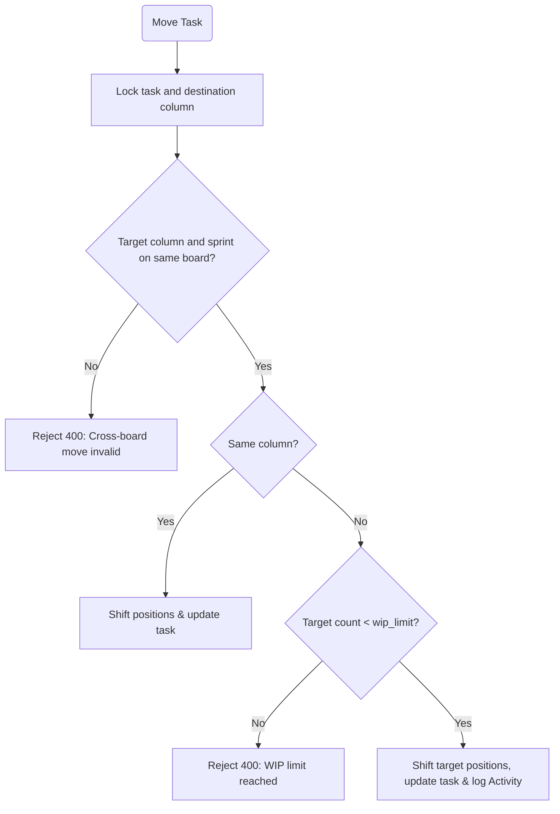
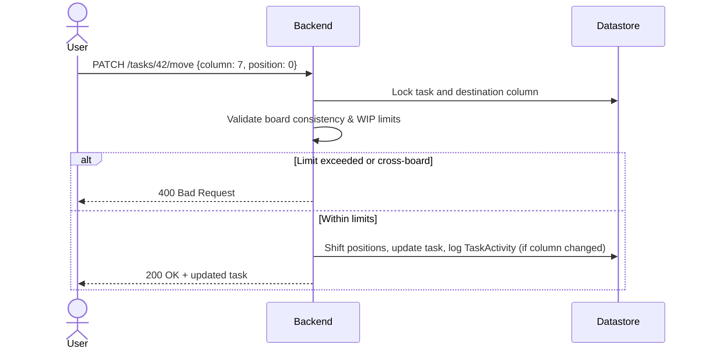

# Epic: Task Lifecycle & Movement (`TL`)

**Entities:** `Task`, `Column`, `TaskActivity`, `Sprint` | **See:** [permissions.md](../permissions.md), [conventions.md](../conventions.md)

## Overview

**User Story:** As a team member, I want to create tasks, drag and drop them across workflow columns, and reorder them while respecting WIP limits and tracking state progression.

## Domain Rules

- **Board Consistency:** A task's `column` and `sprint` must belong to the same board.
- **WIP Limits:**
  - Applied to *entry* (creation or move into a column) and checked excluding the task itself during reorders.
  - Never blocks moving a task *out* of an over-limit column.
  - Subtasks count independently toward their own current columns.
- **Activity Auditing:** Column changes (and creation) log `TaskActivity`. Intra-column reorders **do not** log activity.
- **Cascading Deletes:** Deleting a task recursively removes its subtask subtree, comments, and activity history.

## Capability Matrix

| Operation | Role Required | Behavior / Invariants | Scenarios |
| --- | --- | --- | --- |
| Create Task | Member or Admin | Appends to end of column by default; checks WIP; logs `TaskActivity` | `TL-01`, `TL-02` |
| Retrieve Task | Any member (incl. Guest) | Includes sprint, label, and assignee details | Standard Read |
| Move / Reorder Task | Member or Admin | Atomic WIP lock, sibling shift, and activity audit on column change | `TL-03`–`TL-12` |
| View Task History | Any member (incl. Guest) | Lists column transitions in `TaskActivity` | Standard Read |
| Delete Task | Member or Admin | Cascades to subtasks, comments, and activity rows | `TL-13` |

## Flowcharts & Sequences





## Scenarios

### TL-01: Create a task appends to the end of the column

```gherkin
Given column "Backlog" contains 3 tasks (positions 0-2)
When a user creates a task without a position
Then task position becomes 3 and a `TaskActivity` row is logged (`from_column=null`)

```

### TL-02: Create task rejected when column is at WIP limit

```gherkin
Given column "In Progress" has `wip_limit=3` and contains 3 tasks
When a user attempts to create a task directly in it
Then the request is rejected with 400 Bad Request

```

### TL-03: Move a task to a different column (happy path)

```gherkin
Given task "T-42" is in "In Progress"
When moved to column "Done" at position 0
Then task column updates, sibling positions shift, and a `TaskActivity` row is created

```

### TL-04: Reorder within the same column creates no activity log

```gherkin
Given task "T-42" is moved within its current column
Then position updates and sibling positions shift, but **no** `TaskActivity` is recorded

```

### TL-05 & TL-06: WIP limit checks on move

- **TL-05:** Moving a *new* task into a full column is **rejected (400)**.
- **TL-06:** Reordering a task *already inside* a full column **succeeds** (since it's already counted).

### TL-07: Moving out of an over-limit column is permitted

```gherkin
Given column "In Progress" has 5 tasks but a `wip_limit=3` (lowered later)
When a user moves a task *out* of it
Then the request succeeds unconditionally (WIP gates entry, not exit)

```

### TL-08: Subtask columns are independent

```gherkin
Given parent task "T-10" has subtask "T-11"
When moving "T-10" to a new column
Then subtask "T-11" stays in its original column (subtask columns do not cascade)

```

### TL-09 & TL-10: Blocked tasks and board consistency

- **TL-09:** Moving a blocked task (`is_blocked=true`) **succeeds** (blocked status is informational, not a gate).
- **TL-10:** Moving a task to a column on a *different* board than its assigned sprint is **rejected (400)**.

### TL-11 & TL-12: Concurrency & Sprint retention

- **TL-11:** Concurrent moves into the same column are serialized via row locks; exactly one succeeds and the other gets a 400.
- **TL-12:** Moving a task into a `done`-type column **preserves** its sprint association (not cleared until sprint completion).

### TL-13: Deleting a task performs a deep cascade

```gherkin
Given parent task "T-10" has subtasks, comments, and activity history
When "T-10" is deleted
Then the parent, all subtasks in the tree, their comments, and activity rows are permanently deleted (204 No Content)

```
