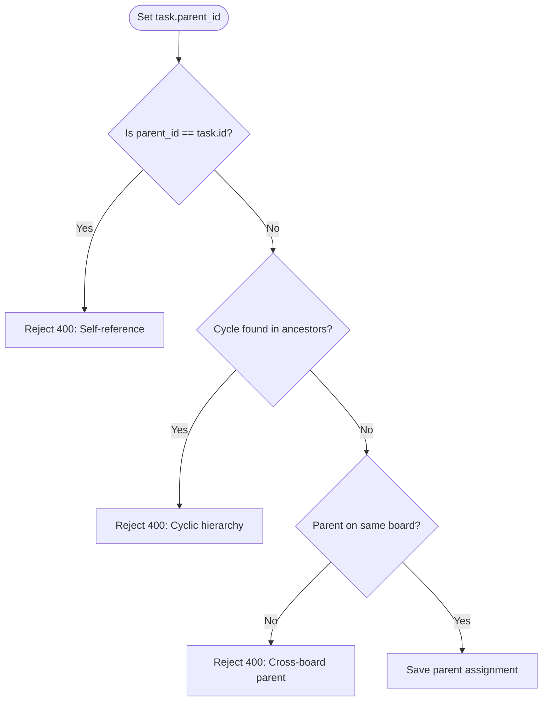

# Epic: Task Organization & Hierarchy (`TO`)

**Entities:** `Task`, `Label`, `User` | **See:** [permissions.md](../permissions.md), [conventions.md](../conventions.md), [workspace_management.md](./workspace_management.md)

## Overview

**User Story:** As a board member, I want to tag, assign, estimate, and decompose tasks into subtasks to structure and categorize work items.

## Domain Rules

- **Assignee Validation:** Assignees must have `User.is_active == true` **and** hold an active `WorkspaceMember` record for the task's workspace.
- **Hierarchy Depth:** Arbitrary nesting depth is permitted, governed strictly by acyclicity and same-board constraints.
- **Tenant Boundaries:**
  - Subtasks and parents must belong to the **same board**.
  - Labels must belong to the **same workspace** as the task's board.

## Capability Matrix

| Operation | Role Required | Behavior / Invariants | Scenarios |
| --- | --- | --- | --- |
| Update Task Details | Member or Admin | Updates title, description, priority, points, due date | Standard Write |
| Assign Task | Member or Admin | Assignee must be an active workspace member | `TO-04` |
| Attach Labels | Member or Admin | Label must belong to the task's workspace | `TO-03` |
| Set Parent Task | Member or Admin | Parent must be on the same board; prevents cycles | `TO-01`, `TO-02` |
| List Subtasks | Any member (incl. Guest) | Retrieves immediate subtasks ordered by position | Standard Read |

## Business Logic Flowchart



## Scenarios

### TO-01 & TO-02: Hierarchy and board validation

- **TO-01:** Setting a parent task that creates a direct or indirect cycle is **rejected (400)**.
- **TO-02:** Setting a parent task belonging to a *different* board is **rejected (400)**.

### TO-03: Labels must belong to the task's workspace

```gherkin
Given task "T-42" in workspace "Acme Corp"
When attempting to attach a label belonging to workspace "Beta Inc"
Then the request is rejected with 400 Bad Request

```

### TO-04: Assignee validation criteria

```gherkin
Given task "T-42" in workspace "Acme Corp"
When attempting to assign the task to a user who lacks a membership record or has `is_active=false`
Then the request is rejected with 400 Bad Request (both conditions are strictly required)

```
