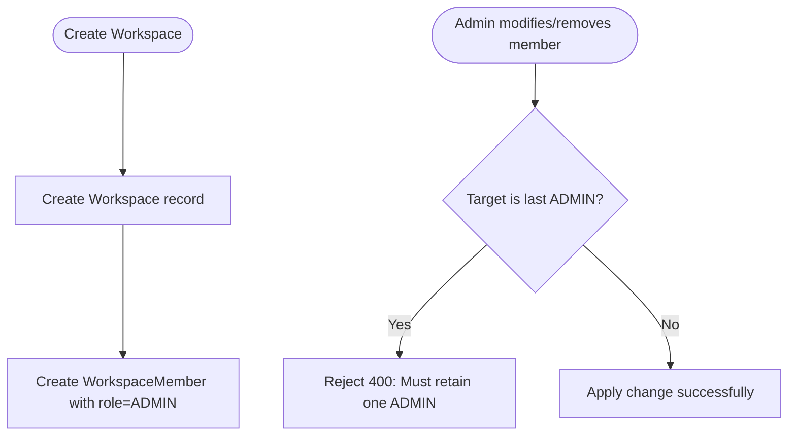

# Epic: Workspace Management (`WS`)

**Entities:** `Workspace`, `WorkspaceMember`, `User`, `Label` | **See:** [permissions.md](../permissions.md), [conventions.md](../conventions.md)

## Overview

**User Stories:**

1. **Ownership:** Workspace creators are automatically assigned as `ADMIN`.
2. **Member Management:** Admins can invite members and assign roles (`ADMIN`, `MEMBER`, `GUEST`).
3. **Tenant Security:** Resources are strictly confined to confirmed workspace members (non-members receive `404 Not Found`).

## Domain Rules

- **Role Scope:** Roles are workspace-specific, not global.
- **Sole Admin Protection:** Workspaces must maintain at least one `ADMIN`; demoting or removing the last admin is blocked (`WS-03`).
- **Guest Role:** Strictly read-only observer across all workspace resources (`WS-05`).
- **Tenant Deletion:** Deleting a workspace triggers a deep cascade across all child boards, tasks, comments, activity, and labels.

## Capability Matrix

| Operation | Role Required | Behavior / Invariants | Scenarios |
| --- | --- | --- | --- |
| Create Workspace | Authenticated user | Auto-assigns creator as `ADMIN` member | `WS-01` |
| List Workspaces | Authenticated user | Lists workspaces where user holds a membership | Standard Read |
| Retrieve Workspace | Any member (incl. Guest) | Returns workspace details and member list | Standard Read |
| Update Workspace | Admin only | Updates name or settings | Standard Write |
| Delete Workspace | Admin only | Cascades to all child entities | `WS-04` |
| Manage Members | Admin only | Add, update roles, or remove members (sole admin protected) | `WS-02`, `WS-03` |

## Business Logic Flowchart



## Scenarios

### WS-01: Creator automatically assigned as ADMIN

```gherkin
Given an authenticated user creates workspace "Engineering"
Then a `WorkspaceMember` record is created linking the user with role `ADMIN`

```

### WS-02: Only admins can manage members

```gherkin
Given workspace member "Bob" has role `MEMBER`
When "Bob" attempts to invite a new user
Then the request is rejected with 403 Forbidden

```

### WS-03: Cannot demote or remove the last remaining admin

```gherkin
Given workspace has only one `ADMIN`
When an attempt is made to change their role or remove them
Then the request is rejected with 400 Bad Request

```

### WS-04: Workspace deletion cascades to all contents

```gherkin
Given an admin deletes workspace "Engineering"
Then the workspace, boards, columns, tasks, comments, activity history, and labels are deleted (204)

```

### WS-05: Guest role is strictly read-only

```gherkin
Given workspace member "Dana" has role `GUEST`
When "Dana" attempts to write (create/update tasks, comments, boards) -> Rejected with 403
When "Dana" attempts to read resources -> Succeeds (200 OK)

```

## Label Management

Labels are workspace-scoped resources reusable across all boards within the workspace.

| Operation | Role Required | Behavior / Invariants | Scenarios |
| --- | --- | --- | --- |
| Create Label | Member or Admin | Name must be unique per workspace; default color `#FFFFFF` | `WS-06` |
| List Labels | Any member (incl. Guest) | Standard Read | Standard Read |
| Update Label | Member or Admin | Rename or recolor label | Standard Write |
| Delete Label | Member or Admin | Automatically detaches label from all associated tasks | Standard Write |

### WS-06: Duplicate label names within a workspace are rejected

```gherkin
Given workspace "Engineering" has label "Urgent"
When a member attempts to create another label named "Urgent" in the same workspace
Then the request is rejected with 400 Bad Request (unique per workspace)

```
